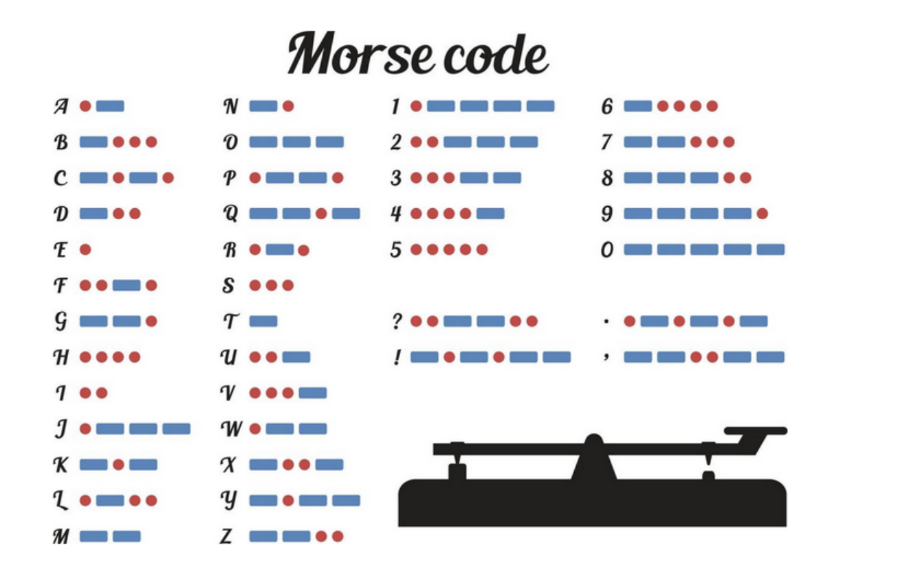

# Ejercicio Código Morse

El Código Morse permite codicar cada caracter del abecedario como una secuencia de
"puntos" y "guiones". Por ejemplo, la letra A se codica como · -, la letra Q se codica como
−− · - y el dígito 1 se codica como · −−−−.
El código Morse no distingue entre mayúsculas y minúsculas, sin embargo sus traducciones
tradicionalmente se muestran en letras mayúsculas. Cuando el mensaje está escrito en
código Morse, se usa un solo espacio para separar los códigos de caracteres y se usan 3
espacios para separar palabras.

Se solicita llevar a cabo una API que reciba un Codigo Morse y devuelva su
traducción en español. Tener como referencia del signicado de cada símbolo la
siguiente tabla:

### Algunos ejemplos

.... --- .-.. .- HOLA

-- . .-. -.-. .- -.. --- .-.. .. -... .-. . MERCADO LIBRE

... .--. .-. .. -. --. SPRING