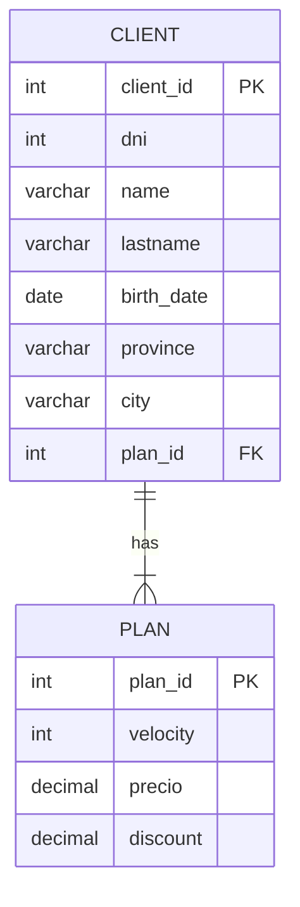

# Relational Databases

DER y SQL

---

## Exercise 1

After stating the company's requirements, it is requested to model them using an DER (Entity-Relationship Diagram).

### Entity-Relationship Diagrama

---
## Exercise 2

Once the database has been modeled and planned, answer the following questions:

a. What is the primary key for the customers table? Justify answer
  -  The primary key of the customer table is client_id since we can generate a unique code, although the client's ID could be used, it is not chosen since there may be a repeated ID

b. What is the primary key for the internet plan table? Justify answer.
  -  The primary key of the plan table is plan_id since it is unique for each record.

c. What would the relationships between tables be like? In which table should there be foreign key? Which field of which table does this foreign key refer to? Justify answer.
  - It is a one-to-many relationship since one user can have one plan and many clients can have one plan. The foreign key must be in the client to associate the plan that said client has.

---
## Exercise 3
    empresa_internet_plan.sql
    empresa_internet_client.sql
---
## Exercise 4
    company_internet_query.sql
---
