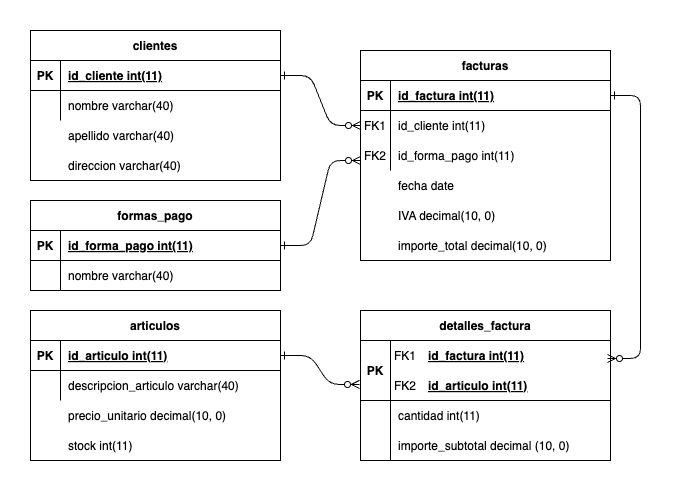

# Ejercicio facturas - Normalización

## Escenario

Luego de un análisis realizado en un sistema de facturación, se ha detectado un mal diseño en la base de datos. La misma, cuenta con una tabla `facturas` que almacena datos de diferente naturaleza.

Como se puede observar, la tabla cuenta con datos que podrían ser normalizados y separados en diferentes entidades.

|#| Nombre        | Tipo          |
|--|---------------|---------------|
|1| id_factura    | int(11)       |
|2| fecha_factura | date          |
|3| forma_pago    | decimal(10,0) |
|4| IVA           | decimal(10,0) |
|5| cantidad      | int(11)       |
|6|importe|decimal(10,0)|
|7|nombre_cliente|varchar(40)|
|8|apellido_cliente|varchar(40)|
|9|direccion_cliente|varchar(40)|
|10|descripcion_articulo|varchar(40)|

## Ejercicio

Se solicita para el escenario anterior:

- **Aplicar reglas de normalización y elaborar un modelo de DER que alcance la tercera forma normal (3FN).**

- **Describir con sus palabras cada paso de la descomposición y aplicación de las reglas para visualizar el planteo realizado.**

  - **1FN**: La tabla ya cumple con la primera forma normal, ya que no hay campos repetidos y cada campo tiene un solo valor.
  - **2FN**: La tabla ya cumple con la segunda forma normal, ya que no tiene claves compuestas (suponiendo que `id_factura` es la PK) y por ende no tiene dependencias parciales.
  - **3FN**: La tabla no cumple con la tercera forma normal, ya que hay dependencias transitivas. Para esto, se separaron los datos del cliente en una tabla `clientes`. La descripción del artículo se movió a la tabla `articulos`. La forma de pago se movió a una tabla `formas_pago`. Se creó una tabla `detalles_factura` para registrar los artículos asociados a cada factura (de manera que se pueda tener varios artículos por factura). Ahora la tabla `facturas` tiene una FK a la PK de `clientes`, `formas_pago` y `detalles_factura`. Esta última tiene una FK a la PK de `articulos`.
