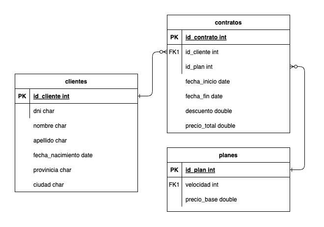

# Ejercicio proveedora de internet

## Escenario

Una empresa proveedora de Internet necesita una base de datos para almacenar cada uno de sus clientes junto con el plan/pack que tiene contratado.

Mediante un análisis previo se conoce que se tiene que almacenar la siguiente información:

- De los clientes se debe registrar: dni, nombre, apellido, fecha de nacimiento, provincia, ciudad.

- En cuanto a los planes de internet: identificación del plan, velocidad ofrecida en megas, precio, descuento.

## Ejercicios

### Ejercicio 1

Luego del planteo de los requerimientos de la empresa, se solicita modelar los mismos mediante un DER (Diagrama Entidad-Relación).

### Ejercicio 2

Una vez modelada y planteada la base de datos, responder a las siguientes preguntas:

**a. ¿Cuál es la primary key para la tabla de clientes? Justificar respuesta.**

La `PK` de `clientes` es `id_cliente`, ya que es un campo único e incremental que identifica a cada cliente. No se recomienda usar el dni porque puede no ser único.

**b. ¿Cuál es la primary key para la tabla de planes de internet? Justificar respuesta.**
    
La `PK` de planes es `id_plan`, ya que es un campo único e incremental que identifica a cada plan.

**c. ¿Cómo serían las relaciones entre tablas? ¿En qué tabla debería haber foreign key? ¿A qué campo de qué tabla hace referencia dicha foreign key? Justificar respuesta.**

La relación entre clientes y planes es de muchos a muchos: un cliente puede contratar diferentes planes a lo largo del tiempo y un plan puede ser contratado por múltiples clientes. Para esto, se creó una tabla `contratos` que tiene una `FK` a `id_cliente` y otra a `id_plan`, además está la `fecha_inicio` y `fecha_fin` del contrato y el `precio_final`. El atributo `precio` que hay en la tabla `planes` hace referencia al precio actual del plan, independiente de cualquier contratación, mientras que el atributo `precio_total` de esta tabla es para registrar el precio del plan (con descuento) en el momento que se creó el contrato.

### Ejercicio 3

Una vez realizado el planteo del diagrama y de haber respondido estas preguntas, utilizar PHPMyAdmin o MySQL Workbench para ejecutar lo siguiente:

a. Se solicita crear una nueva base de datos llamada “empresa_internet”.

b. Incorporar 10 registros en la tabla de clientes y 5 en la tabla de planes de internet.

c. Realizar las asociaciones/relaciones correspondientes entre estos registros.

**Resolución**: [init.sql](init.sql)

### Ejercicio 4

Plantear 10 consultas SQL que se podrían realizar a la base de datos. Expresar las sentencias.

**Consultas planteadas**:

1. Obtener todos los clientes con sus nombres y apellidos.
2. Obtener todos los planes y su precio base, ordenados por velocidad de menor a mayor.
3. Obtener todos los contratos activos (fecha de inicio menor a la fecha actual).
4. Ver todos los clientes de Córdoba
5. Ver los clientes que tienen contratos con un descuento mayor al 15% (ordenado por descuento de mayor a menor).
6. Obtener el total de clientes que han contratado un plan específico.
7. Ver el precio total de los planes para un cliente específico.
8. Obtener la fecha de inicio y fin de todos los contratos con el plan de velocidad 100.
9. Obtener el top 3 planes con mayor velocidad.
10. Consultar cuánto recauda la empresa por cada plan.

**Resolución**: [consultas.sql](consultas.sql)