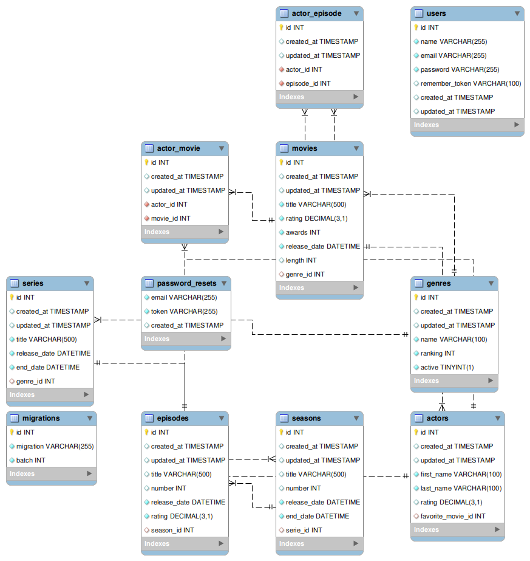

# Ejercicio Movies - Consultas SQL avanzadas 2

## Consigna

**Resolución:** [consultas.sql](consultas.sql)

Tomando la base de datos **movies_db.sql**, se solicita:

1. **Agregar una película a la tabla movies.**

2. **Agregar un género a la tabla genres.**

3. **Asociar a la película del punto 1. genre el género creado en el punto 2.**

4. **Modificar la tabla actors para que al menos un actor tenga como favorita la película agregada en el punto 1.**

5. **Crear una tabla temporal copia de la tabla movies.**

6. **Eliminar de esa tabla temporal todas las películas que hayan ganado menos de 5 awards.**

7. **Obtener la lista de todos los géneros que tengan al menos una película.**

8. **Obtener la lista de actores cuya película favorita haya ganado más de 3 awards.**

9. **Crear un índice sobre el nombre en la tabla movies.**

10. **Chequee que el índice fue creado correctamente.**

11. **En la base de datos movies ¿Existiría una mejora notable al crear índices? Analizar y justificar la respuesta.**

    Puede ser conveniente indexar el título tanto de las películas como de las series, ya que este campo puede funcionar 
    como un identificador único en muchas ocasiones y pueden hacerse muchas consultas basadas en este campo. 
    Por ejemplo, si quisiera hacer una consulta relacionada a la película 'Avatar' voy a tener que hacer un JOIN 
    con el campo `title`. Este es un ejemplo de que el título puede considerarse como identificatorio y usar índices 
    puede acelerar significativamente estas consultas.

12. **¿En qué otra tabla crearía un índice y por qué? Justificar la respuesta.**

    Además del `title` de `movies`, sería conveniente crear un índice en el campo `title` de `series`.

**Recordar el DER del escenario:**

