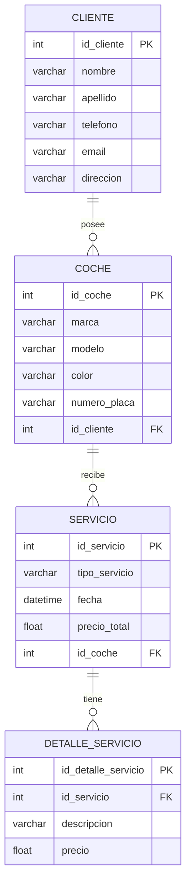

```mermaid
erDiagram
    CLIENTE {
        int id_cliente PK
        varchar nombre
        varchar apellido
        varchar telefono
        varchar email
        varchar direccion
    }

    COCHE {
        int id_coche PK
        varchar marca
        varchar modelo
        varchar color
        varchar numero_placa
        int id_cliente FK
    }

    SERVICIO {
        int id_servicio PK
        varchar tipo_servicio
        datetime fecha
        float precio_total
        int id_coche FK
    }

    DETALLE_SERVICIO {
        int id_detalle_servicio PK
        int id_servicio FK
        varchar descripcion
        float precio
    }

    CLIENTE ||--o{ COCHE : posee
    COCHE ||--o{ SERVICIO : recibe
    SERVICIO ||--o{ DETALLE_SERVICIO : tiene
```
