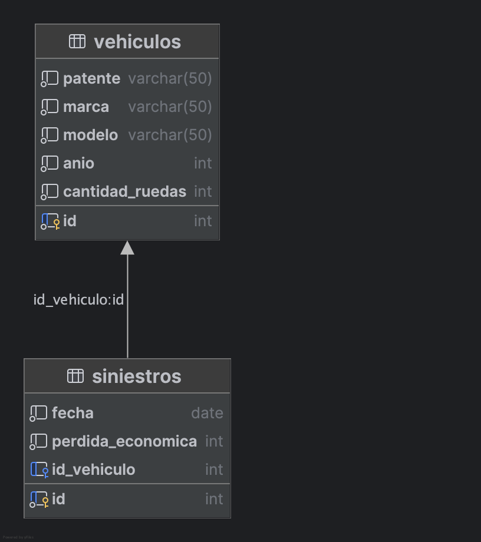

# Ejercicio Empresa de Seguros - Práctica HQL

## Dominio

Una empresa de seguros de autos necesita una aplicación que le permita administrar la información de los siniestros de los vehículos asegurados que son denunciados. Algunos vehículos son autos particulares y otros son autos utilitarios o camiones.

Para ello se pide construir un servicio Rest que permita lograrlo.

Para esta aplicación, tendremos dos entidades principales:

1. **Vehículo**, la cual tendrá los siguientes atributos:

    - Id del vehículo 
    - Patente 
    - Marca 
    - Modelo 
    - Año de fabricación 
    - Cantidad de ruedas

2. **Siniestro**, la cual tendrá los siguientes atributos:

    - Id del siniestro 
    - Fecha del siniestro 
    - Pérdida económica 
    - Id del vehículo denunciado

De las clases mencionadas, se sabe que un vehículo puede denunciar múltiples siniestros y un siniestro pertenece a un solo vehículo.



## Requerimientos

### Listar las patentes de todos los vehículos registrados.

`GET /vehiculos/patentes`

```json
[
    "ABC123",
    "DEF456",
    "GHI789",
    "JKL012",
    "MNO345",
    "PQR678",
    "STU901",
    "VWX234",
    "YZA567",
    "BCD890"
]
```

### Listar la patente y la marca de todos los vehículos ordenados por año de fabricación. 

`GET /vehiculos/patentes-and-marcas`

```json
[
    {
        "patente": "ABC123",
        "marca": "Ford"
    },
    {
        "patente": "BCD890",
        "marca": "Honda"
    },
    {
        "patente": "VWX234",
        "marca": "Nissan"
    },
    {
        "patente": "STU901",
        "marca": "Toyota"
    }
]
```   

### Listar la patente de todos los vehículos que tengan más de cuatro ruedas y hayan sido fabricados en el corriente año. 

`GET /vehiculos/cuatro-ruedas-and-current-year`

```json
[
    "DEF456",
    "GHI789"
]
```

### Listar la matrícula, marca y modelo de todos los vehículos que hayan tenido un siniestro con pérdida mayor de 10000 pesos. 

`GET /vehiculos/siniestro-mayor-a-10000`

```json
[
    {
        "patente": "ABC123",
        "marca": "Ford",
        "modelo": "Fiesta"
    },
    {
        "patente": "DEF456",
        "marca": "Chevrolet",
        "modelo": "Corsa"
    },
    {
        "patente": "GHI789",
        "marca": "Fiat",
        "modelo": "Uno"
    },
    {
        "patente": "JKL012",
        "marca": "Renault",
        "modelo": "Clio"
    },
    {
        "patente": "MNO345",
        "marca": "Peugeot",
        "modelo": "208"
    }
]
```

### Listar la matrícula, marca y modelo de todos los vehículos que hayan tenido un siniestro con pérdida mayor de 10000 pesos y mostrar a cuánto ascendió la pérdida total de todos ellos.

Almacenar el resultado de la consulta en una lista de listas de dos elementos; el primero será un Vehículo y el segundo un Integer. Habrá que crear la clase VehiculoSiniestro con su correspondiente constructor.

```json
[
   {
      "vehiculo": {
         "id": 1,
         "marca": "Ford",
         "modelo": "Fiesta",
         "patente": "ABC123",
         "anio": 2010,
         "cantidad_ruedas": 4
      },
      "total_perdida_economica": 1500000
   },
   {
      "vehiculo": {
         "id": 2,
         "marca": "Chevrolet",
         "modelo": "Corsa",
         "patente": "DEF456",
         "anio": 2025,
         "cantidad_ruedas": 4
      },
      "total_perdida_economica": 500000
   },
   {
      "vehiculo": {
         "id": 3,
         "marca": "Fiat",
         "modelo": "Uno",
         "patente": "GHI789",
         "anio": 2025,
         "cantidad_ruedas": 4
      },
      "total_perdida_economica": 300000
   },
   {
      "vehiculo": {
         "id": 4,
         "marca": "Renault",
         "modelo": "Clio",
         "patente": "JKL012",
         "anio": 2018,
         "cantidad_ruedas": 4
      },
      "total_perdida_economica": 400000
   },
   {
      "vehiculo": {
         "id": 5,
         "marca": "Peugeot",
         "modelo": "208",
         "patente": "MNO345",
         "anio": 2019,
         "cantidad_ruedas": 4
      },
      "total_perdida_economica": 500000
   }
]
```