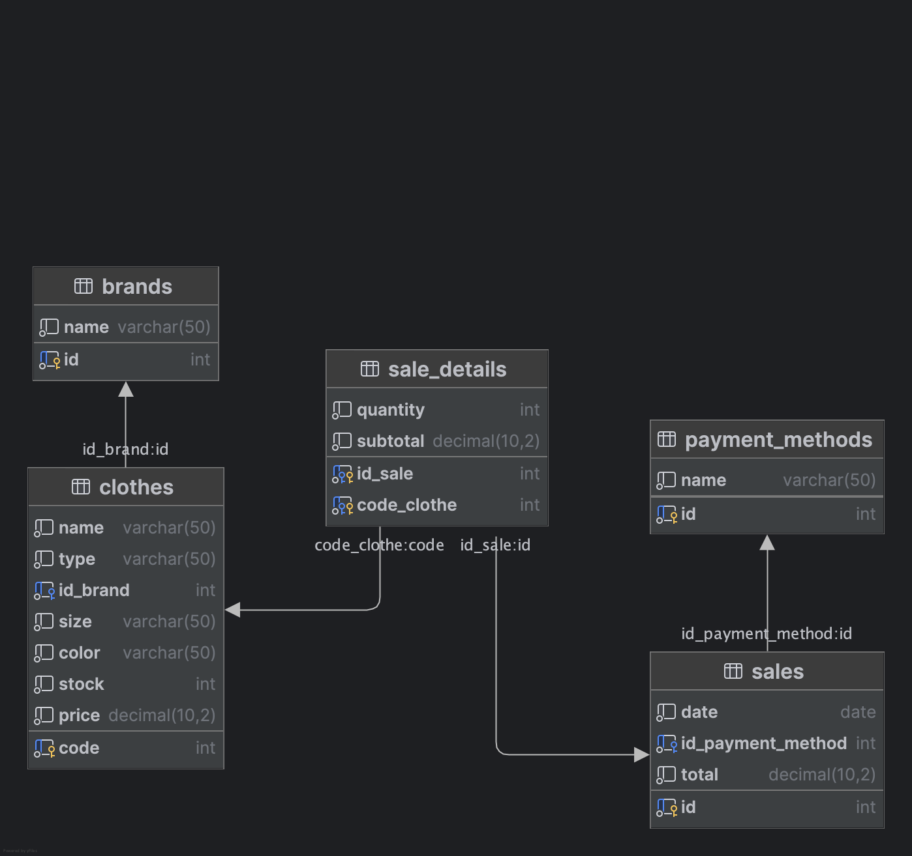

# Ejercicio prendas para showroom

## Primera parte

La dueña de un showroom desea poder contar con una API que le permita llevar a cabo el control de las prendas que ofrece y vende a cada uno de sus clientes. De cada prenda necesita almacenar los datos: codigo, nombre, tipo, marca, color, talle, cantidad, precio_venta.



A partir de eso, la API debe ser capaz de realizar las siguientes acciones:

|Método| URI                        | Acción                                                                                                          |
|---|----------------------------|-----------------------------------------------------------------------------------------------------------------|
|POST| `/api/clothes`             | Crear una nueva prenda.                                                                                         
|GET| `/api/clothes`             | Devolver todas las prendas                                                                                      |
|GET| `/api/clothes/{code}`      | Devolver una prenda en particular                                                                               |
|PUT| `/api/clothes/{code}`      | Actualizar una prenda en particular                                                                             |
|DELETE| `/api/clothes/{code}`      | Eliminar una prenda en particular                                                                               |
|GET| `/api/clothes?size={size}` | Traer todas las prendas de un determinado talle                                                                 |
|GET| `/api/clothes?name={name}` | Buscar todas las prendas en cuyo nombre aparezca el parámetro. No se tienen en cuenta mayúsculas ni minúsculas. |

**Nota**: para este ejercicio utilizar una base de datos relacional.

## Segunda parte

La dueña del Showroom decidió que, además de poder manejar sus prendas, necesita conocer datos de sus ventas y qué productos vendió en ellas. Para ello precisa que en la base de datos se pueda almacenar de cada venta lo siguiente: numero, fecha, total, medio de pago, lista de prendas.

A partir de esto se necesita que la API además de lo realizado en el punto a, ahora también sea capaz de:

|Método| URI                           | Acción                                                       |
|---|-------------------------------|--------------------------------------------------------------|
|POST| `/api/sales`                  | Crear una nueva venta.                                       |
|GET| `/api/sales`                  | Devolver todas las ventas.                                   |
|GET| `/api/sales/{number}`         | Devolver una venta en particular.                            |
|PUT| `/api/sales/{number}`         | Actualizar una venta en particular.                          |
|DELETE| `/api/sales/{number}`         | Eliminar una venta en particular.                            |
|GET| `/api/sales?date=22/05/2022`  | Traer todas las ventas realizadas en una determinada fecha.  |
|GET| `/api/sales/clothes/{number}` | Traer la lista completa de prendas de una determinada venta. |

**Nota**: Para poder llevar a cabo esto, realizar las correspondientes relaciones, mapeos en base de datos y operaciones necesarias.

# Endpoints

### Crear una nueva prenda

`POST /api/clothes`

Payload:
```json
{
    "name": "Nike Air Max",
    "type": "Shoes",
    "brand": "Nike",
    "size": "42",
    "color": "Red",
    "stock": 10,
    "price": 120.0
}
```

Response:
```
Clothe with code 25 created
```

### Devolver todas las prendas, filtradas por size o name

`GET /api/clothes`
`GET /api/clothes?size={size}`
`GET /api/clothes?name={name}`

Response:

```json
[
    {
        "name": "Nike Air Max",
        "type": "Shoes",
        "brand": "Nike",
        "size": "42",
        "color": "Red",
        "stock": 10,
        "price": 120.0
    },
    {
        "name": "Adidas UltraBoost",
        "type": "Shoes",
        "brand": "Adidas",
        "size": "43",
        "color": "Black",
        "stock": 15,
        "price": 150.0
    },
    {
        "name": "Puma Suede Classic",
        "type": "Shoes",
        "brand": "Puma",
        "size": "40",
        "color": "White",
        "stock": 20,
        "price": 80.0
    },
    {
        "name": "Reebok Classic Leather",
        "type": "Shoes",
        "brand": "Reebok",
        "size": "44",
        "color": "Blue",
        "stock": 12,
        "price": 90.0
    }
]
```

### Devolver una prenda en particular

`GET /api/clothes/{code}`

Response:

```json
{
    "name": "Adidas UltraBoost",
    "type": "Shoes",
    "brand": "Adidas",
    "size": "43",
    "color": "Black",
    "stock": 15,
    "price": 150.0
}
```

### Actualizar una prenda en particular

`PUT /api/clothes/{code}`

Payload:

```json
{
    "name": "Otro nombre"
}
```

Response:

```json
{
    "name": "Otro nombre",
    "type": "Shoes",
    "brand": "Adidas",
    "size": "43",
    "color": "Black",
    "stock": 15,
    "price": 150.0
}
```

### Eliminar una prenda en particular

`DELETE /api/clothes/{code}`

Response: no content

### Crear una nueva venta

`POST /api/sales`

Payload:

```json
{
    "date": "2024-02-01",
    "total": 320.0,
    "payment_method": "Cash",
    "sale_details": [
        {
            "clothe": {
                "name": "Nike Air Max",
                "type": "Shoes",
                "brand": "Nike",
                "size": "42",
                "color": "Red",
                "stock": 10,
                "price": 120.0
            },
            "quantity": 2,
            "subtotal": 240.0
        },
        {
            "clothe": {
                "name": "Adidas Originals",
                "type": "T-Shirt",
                "brand": "Adidas",
                "size": "L",
                "color": "Black",
                "stock": 40,
                "price": 40.0
            },
            "quantity": 2,
            "subtotal": 80.0
        }
    ]
}
```

Response:
```
Sale with number 20 created
```

### Devolver todas las ventas o filtradas por fecha

`GET /api/sales`

Response:

```json
[
    {
        "date": "2024-02-01",
        "total": 320.0,
        "payment_method": "Cash",
        "sale_details": [
            {
                "clothe": {
                    "name": "Nike Air Max",
                    "type": "Shoes",
                    "brand": "Nike",
                    "size": "42",
                    "color": "Red",
                    "stock": 10,
                    "price": 120.0
                },
                "quantity": 2,
                "subtotal": 240.0
            },
            {
                "clothe": {
                    "name": "Adidas Originals",
                    "type": "T-Shirt",
                    "brand": "Adidas",
                    "size": "L",
                    "color": "Black",
                    "stock": 40,
                    "price": 40.0
                },
                "quantity": 2,
                "subtotal": 80.0
            }
        ]
    },
    {
        "date": "2025-02-02",
        "total": 450.0,
        "payment_method": "Credit Card",
        "sale_details": [
            {
                "clothe": {
                    "name": "Otro nombre",
                    "type": "Shoes",
                    "brand": "Adidas",
                    "size": "43",
                    "color": "Black",
                    "stock": 15,
                    "price": 150.0
                },
                "quantity": 3,
                "subtotal": 450.0
            }
        ]
    },
    {
        "date": "2025-02-03",
        "total": 275.0,
        "payment_method": "Debit Card",
        "sale_details": [
            {
                "clothe": {
                    "name": "Puma Suede Classic",
                    "type": "Shoes",
                    "brand": "Puma",
                    "size": "40",
                    "color": "White",
                    "stock": 20,
                    "price": 80.0
                },
                "quantity": 5,
                "subtotal": 400.0
            }
        ]
    }
]
```

### Devolver una venta en particular

`GET /api/sales/{number}`

Response:

```json
{
    "date": "2025-02-08",
    "total": 280.0,
    "payment_method": "Credit Card",
    "sale_details": [
        {
            "clothe": {
                "name": "Nike Dri-FIT",
                "type": "T-Shirt",
                "brand": "Nike",
                "size": "M",
                "color": "White",
                "stock": 30,
                "price": 35.0
            },
            "quantity": 2,
            "subtotal": 72.0
        },
        {
            "clothe": {
                "name": "Adidas Originals",
                "type": "T-Shirt",
                "brand": "Adidas",
                "size": "L",
                "color": "Black",
                "stock": 40,
                "price": 40.0
            },
            "quantity": 3,
            "subtotal": 120.0
        }
    ]
}
```

### Actualizar una venta en particular

`PUT /api/sales/{number}`

Payload:

```json
{
    "payment_method": "Debit Card"
}
```

Response:

```json
{
    "date": "2025-02-08",
    "total": 280.0,
    "payment_method": "Debit Card",
    "sale_details": [
        {
            "clothe": {
                "name": "Nike Dri-FIT",
                "type": "T-Shirt",
                "brand": "Nike",
                "size": "M",
                "color": "White",
                "stock": 30,
                "price": 35.0
            },
            "quantity": 2,
            "subtotal": 72.0
        },
        {
            "clothe": {
                "name": "Adidas Originals",
                "type": "T-Shirt",
                "brand": "Adidas",
                "size": "L",
                "color": "Black",
                "stock": 40,
                "price": 40.0
            },
            "quantity": 3,
            "subtotal": 120.0
        }
    ]
}
```

### Eliminar una venta en particular

`DELETE /api/sales/{number}`

Response: no content

### Traer la lista completa de prendas de una determinada venta

`GET /api/sales/clothes/{number}`

Response:

```json
[
    {
        "name": "Nike Dri-FIT",
        "type": "T-Shirt",
        "brand": "Nike",
        "size": "M",
        "color": "White",
        "stock": 30,
        "price": 35.0
    },
    {
        "name": "Adidas Originals",
        "type": "T-Shirt",
        "brand": "Adidas",
        "size": "L",
        "color": "Black",
        "stock": 40,
        "price": 40.0
    }
]
```
